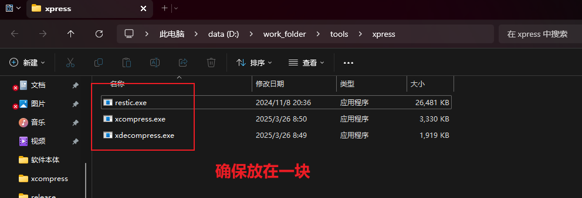

xcompress 是基于 restic 的备份工具，可以快速备份、恢复文件，并且压缩速度比 7z, rar, zip 快好几倍，而且支持增量备份，也不会被网盘检测敏感内容，可以更好的加密自己的内容防止违禁和解密。

更多教程见文档，最新的使用教程都在这里 ➡️ https://www.yuque.com/xtnxnb/qo095a/tnve5f0rtnu9ad96
🔋文件可以从这里快速下载
[123 主分享链接](https://www.yuque.com/xtnxnb/qo095a/tnve5f0rtnu9ad96)
[123 备用分享链接](https://www.123684.com/s/hTcVjv-CXh8)
[百度网盘分享链接](https://pan.baidu.com/s/1LtnVxWQsN5fYBpG9p7S92Q?pwd=aqny)
提取码：aqny
下载即用

🧠软件开发初衷
快速批量安全备份，写好备份配置只要双击就会对电脑当中的文件进行增量备份，并且上传云盘也不会面临被检测违禁的可能（软件采用  AES-256-CTR  对称加密算法，几乎是目前已知最安全的算法，忘记密码也几乎没有恢复的可能，所以请记住压缩密码）
当然也为了防止炸链，毕竟下载分享的资源老是失效是我深恶痛疾的，老是有人在线解压，而且如果采用 restic 加密，不仅压缩速度快还非常安全，如果有相关知识还可以使用增量备份自动备份电脑文件不局限于对分享资源备份，只是普及率不高而且使用也比较复杂于是就有了这个软件，为了更好的迎合大众使用

✅主要优点
1. 加密
2. 防检测
3. 增量备份
4. 备份速度快（普通压缩包五六倍压缩速度）
5. 软件对新手友好

🖥支持的系统
支持系统：windows, linux. macos

✏️使用什么编写
restic 和 xcompress 基于 golang 语言编写，速度快，内存占用低
decompress 基于 rust 编写，同样拥有卓越的性能和较低的内存占用

---

# 简单操作

这个教程是面向所有小白使用，即使你不会任何电脑相关知识能进行操作。

文件准备
首先下载好三个文件 ，确保放在同一个目录下
- restic.exe：软件基于 restic，这是 restic 本地
- xcompress.exe：用于压缩文件
- xdecompress.exe：用于解压文件 这里不小心把文件改成了 decompress 不要在意(*/ω＼*)

**windows 快速备份文件**
将需要备份的文件夹拖动到程序，输入相应的备份密码等信息就可以备份

接着保管好输出的备份文件夹 "我的图片备份"
我们的压缩文件是一个文件夹，务必保存好，里面不要动，不然就会损坏无法找回！！！
如果需要恢复，只需要拖动其到 decompress.exe 即可

你的每一口甜蜜支持，都会催赶我前进的脚步，谢谢你好心人，Ciallo～(∠・ω< ) ！！！

